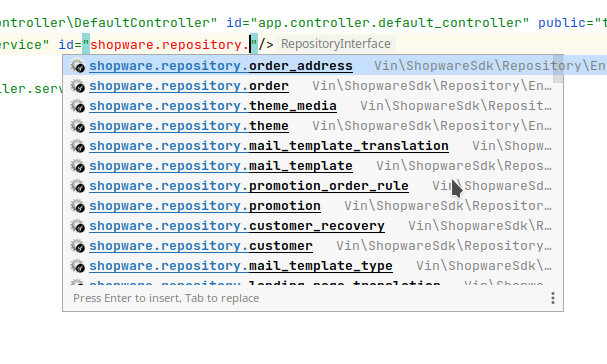

# ShopwareAppSystemBundle

## Overview

This bundle is used for forging Shopware applications with the base capabilities needed for their development:

- Authentication,
- Registration/confirmation controllers,
- Shopware API,
- Persisting shop data,
- Command to create manifests,
- Handling events.

This bundle provides a set of useful components that you can use in your apps:

1. Controller argument resolvers
  - `bitbag.shopware_app_system.argument_resolver.event_resolver` and
  - `bitbag.shopware_app_system.argument_resolver.context_resolver`

These two are used to provide context and event objects for controller actions:

```injectablephp
public function index(Context $context, EventInterface $event): Response
{
    // Available properties of context objects:
    $context->languageId
    $context->currencyId
    $context->versionId
    $context->compatibility
    $context->inheritance
    $context->accessToken
    $context->apiEndpoint
    
    // Available properties of event objects:
    $event->getShopUrl();
    $event->getShopId();
    $event->getAppVersion();

    /**
     * @var EventDataInterface
     */
    $eventData = $event->getEventData();
    
    // Available properties of event data objects:
    $eventData->getEntity();
    $eventData->getOperation();
    $eventData->getPrimaryKey();
    $eventData->getUpdatedFields();
    $eventData->getEvent();
    $eventData->getPayload();
}
```

2. Repositories
- You can inject Shopware repositories by their name, e.g. `shopware.repository.product`:



They are mapped to remote Shopware repositories accessed through the API.

3. `Event` and `EventData`

After you have injected an event object into your controller action, you can use it for a variety of things. The most common pattern would be to get the primary key of the entity that the webhook reacts to:

```injectablephp

/** @var EventDataInterface[] $eventData */
$eventData = $event->getEventData();

// Shopware may send data for more than one entity
$productData = $eventData[0] ?? throw new \InvalidArgumentException();

$product = $this->productRepository->get($productData->getPrimaryKey(), new Criteria(), $context);
```

